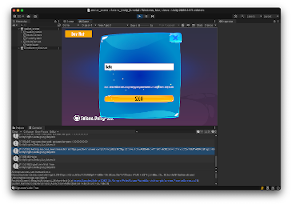

# Hello Crypto

This demo tutorial shows how to integrate cryptocurrency features into your apps/games. A crypto integration “hello-world”.

Developers have many choices of blockchains and cryptocurrencies when deciding to add in-game transactions and digital asset (Web3) features to their games. For this tutorial, we have used the Solana blockchain to demonstrate the concepts.

This project was initially launched by visualSilicon in April 2024 for the Toke2049 event in Dubai/UAE.

You can find the steps in "[Getting Started with Solana in Unity](./tutorials/getting-started-with-solana-in-unity/README.MD)" which shows how to integrate Solana into your Unity games.

# About visualSilicon®

A registered trademark and the trading brand of EAST TECH MEDIA LIMITED, visualSilicon.com is a media and technology company based in Cambridge, England, United Kingdom.

[visualSilicon](https://www.visualSilicon.com) produces technical content (such as videos, articles and github projects) and provides hardware and software co-design consultancy and development services to hardware vendors, games studios, and startups in emerging technology sectors around the world.

We are a group of storytellers with roots in gaming, computer graphics, and software/hardware engineering. We have crafted compelling narratives for industry giants like [ARM, Unity](https://learn.arm.com/learning-paths/smartphones-and-mobile/using_unity_machine_learning_agents/02-ml-in-games/), and the [Khronos Group](https://www.youtube.com/playlist?list=PLYO7XTAX41FNVFVQ2yS7JNAWYou5giSlH). And we are on a mission to demystify emerging technology for our audiences and clients.

You can find out more by reading our flyers:

Our website is located at [https://visualsilicon.com/](https://visualsilicon.com/)
